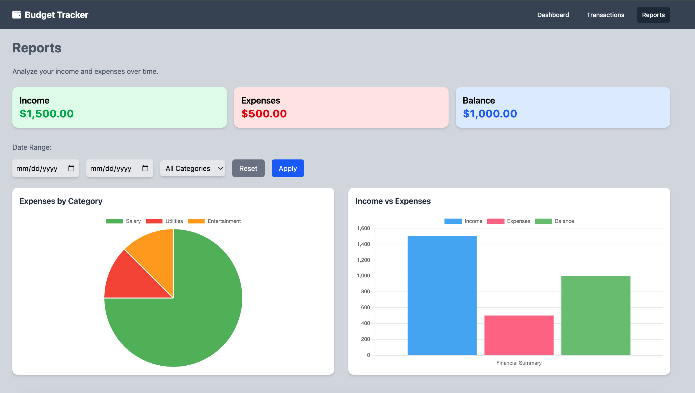

# PersonalBudgetTracker

This project is a financial management web app built with Angular.

## Features
- Add, edit, and delete transactions.
- View financial summaries in charts.
- Responsive design.

## Screenshots

### Transactions

### Reports

